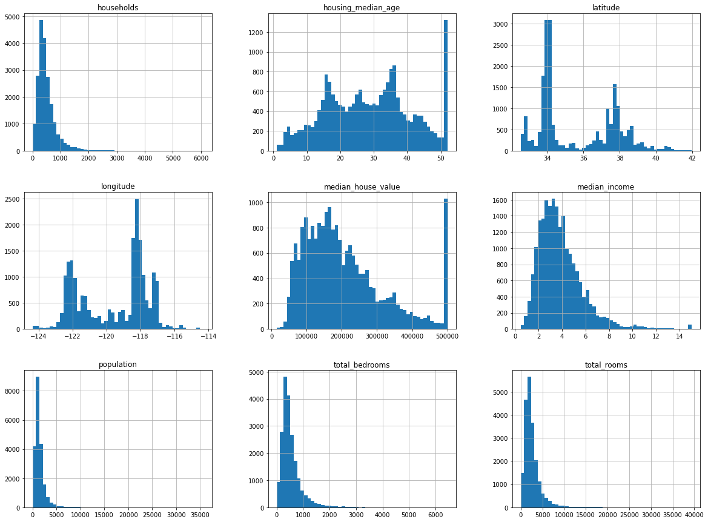
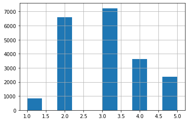
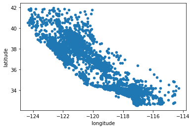
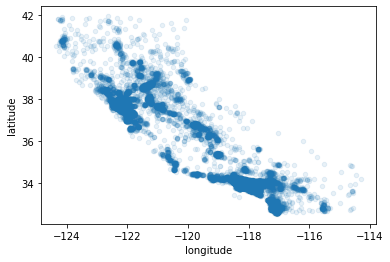
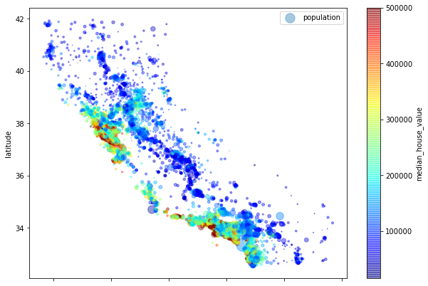
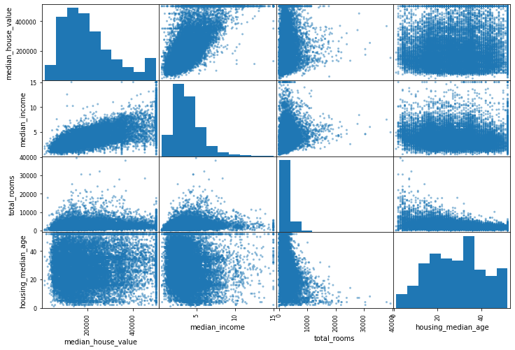
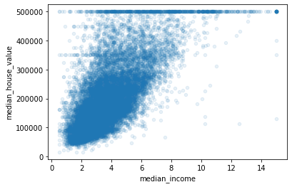

## Download the data


```python
import os
import tarfile
import urllib
```


```python
DOWNLOAD_ROOT = "https://raw.githubusercontent.com/ageron/handson-ml2/master/"
HOUSING_PATH = os.path.join("datasets", "housing")
HOUSING_URL = DOWNLOAD_ROOT + "datasets/housing/housing.tgz"
```


```python
def fetch_housing_data(housing_url=HOUSING_URL, housing_path=HOUSING_PATH):
    os.makedirs(housing_path, exist_ok=True)
    tgz_path = os.path.join(housing_path, "housing.tgz")
    urllib.request.urlretrieve(housing_url, tgz_path)
    housing_tgz = tarfile.open(tgz_path)
    housing_tgz.extractall(path=housing_path)
    housing_tgz.close()
```


```python
fetch_housing_data()
```


```python
import pandas as pd
```


```python
def load_housing_data(housing_path=HOUSING_PATH):
    csv_path = os.path.join(housing_path, "housing.csv")
    return pd.read_csv(csv_path)
```

## Take a Quick Look at the Data Structure


```python
housing = load_housing_data()
housing.head()
```


<div>
<table border="1" class="dataframe">
  <thead>
    <tr style="text-align: right;">
      <th></th>
      <th>longitude</th>
      <th>latitude</th>
      <th>housing_median_age</th>
      <th>total_rooms</th>
      <th>total_bedrooms</th>
      <th>population</th>
      <th>households</th>
      <th>median_income</th>
      <th>median_house_value</th>
      <th>ocean_proximity</th>
    </tr>
  </thead>
  <tbody>
    <tr>
      <th>0</th>
      <td>-122.23</td>
      <td>37.88</td>
      <td>41.0</td>
      <td>880.0</td>
      <td>129.0</td>
      <td>322.0</td>
      <td>126.0</td>
      <td>8.3252</td>
      <td>452600.0</td>
      <td>NEAR BAY</td>
    </tr>
    <tr>
      <th>1</th>
      <td>-122.22</td>
      <td>37.86</td>
      <td>21.0</td>
      <td>7099.0</td>
      <td>1106.0</td>
      <td>2401.0</td>
      <td>1138.0</td>
      <td>8.3014</td>
      <td>358500.0</td>
      <td>NEAR BAY</td>
    </tr>
    <tr>
      <th>2</th>
      <td>-122.24</td>
      <td>37.85</td>
      <td>52.0</td>
      <td>1467.0</td>
      <td>190.0</td>
      <td>496.0</td>
      <td>177.0</td>
      <td>7.2574</td>
      <td>352100.0</td>
      <td>NEAR BAY</td>
    </tr>
    <tr>
      <th>3</th>
      <td>-122.25</td>
      <td>37.85</td>
      <td>52.0</td>
      <td>1274.0</td>
      <td>235.0</td>
      <td>558.0</td>
      <td>219.0</td>
      <td>5.6431</td>
      <td>341300.0</td>
      <td>NEAR BAY</td>
    </tr>
    <tr>
      <th>4</th>
      <td>-122.25</td>
      <td>37.85</td>
      <td>52.0</td>
      <td>1627.0</td>
      <td>280.0</td>
      <td>565.0</td>
      <td>259.0</td>
      <td>3.8462</td>
      <td>342200.0</td>
      <td>NEAR BAY</td>
    </tr>
  </tbody>
</table>
</div>


```python
housing.info()
```

    <class 'pandas.core.frame.DataFrame'>
    RangeIndex: 20640 entries, 0 to 20639
    Data columns (total 10 columns):
     #   Column              Non-Null Count  Dtype  
    ---  ------              --------------  -----  
     0   longitude           20640 non-null  float64
     1   latitude            20640 non-null  float64
     2   housing_median_age  20640 non-null  float64
     3   total_rooms         20640 non-null  float64
     4   total_bedrooms      20433 non-null  float64
     5   population          20640 non-null  float64
     6   households          20640 non-null  float64
     7   median_income       20640 non-null  float64
     8   median_house_value  20640 non-null  float64
     9   ocean_proximity     20640 non-null  object 
    dtypes: float64(9), object(1)
    memory usage: 1.6+ MB
    


```python
housing['ocean_proximity'].value_counts()
```


    <1H OCEAN     9136
    INLAND        6551
    NEAR OCEAN    2658
    NEAR BAY      2290
    ISLAND           5
    Name: ocean_proximity, dtype: int64


```python
housing.describe()
```


<div>
<table border="1" class="dataframe">
  <thead>
    <tr style="text-align: right;">
      <th></th>
      <th>longitude</th>
      <th>latitude</th>
      <th>housing_median_age</th>
      <th>total_rooms</th>
      <th>total_bedrooms</th>
      <th>population</th>
      <th>households</th>
      <th>median_income</th>
      <th>median_house_value</th>
    </tr>
  </thead>
  <tbody>
    <tr>
      <th>count</th>
      <td>20640.000000</td>
      <td>20640.000000</td>
      <td>20640.000000</td>
      <td>20640.000000</td>
      <td>20433.000000</td>
      <td>20640.000000</td>
      <td>20640.000000</td>
      <td>20640.000000</td>
      <td>20640.000000</td>
    </tr>
    <tr>
      <th>mean</th>
      <td>-119.569704</td>
      <td>35.631861</td>
      <td>28.639486</td>
      <td>2635.763081</td>
      <td>537.870553</td>
      <td>1425.476744</td>
      <td>499.539680</td>
      <td>3.870671</td>
      <td>206855.816909</td>
    </tr>
    <tr>
      <th>std</th>
      <td>2.003532</td>
      <td>2.135952</td>
      <td>12.585558</td>
      <td>2181.615252</td>
      <td>421.385070</td>
      <td>1132.462122</td>
      <td>382.329753</td>
      <td>1.899822</td>
      <td>115395.615874</td>
    </tr>
    <tr>
      <th>min</th>
      <td>-124.350000</td>
      <td>32.540000</td>
      <td>1.000000</td>
      <td>2.000000</td>
      <td>1.000000</td>
      <td>3.000000</td>
      <td>1.000000</td>
      <td>0.499900</td>
      <td>14999.000000</td>
    </tr>
    <tr>
      <th>25%</th>
      <td>-121.800000</td>
      <td>33.930000</td>
      <td>18.000000</td>
      <td>1447.750000</td>
      <td>296.000000</td>
      <td>787.000000</td>
      <td>280.000000</td>
      <td>2.563400</td>
      <td>119600.000000</td>
    </tr>
    <tr>
      <th>50%</th>
      <td>-118.490000</td>
      <td>34.260000</td>
      <td>29.000000</td>
      <td>2127.000000</td>
      <td>435.000000</td>
      <td>1166.000000</td>
      <td>409.000000</td>
      <td>3.534800</td>
      <td>179700.000000</td>
    </tr>
    <tr>
      <th>75%</th>
      <td>-118.010000</td>
      <td>37.710000</td>
      <td>37.000000</td>
      <td>3148.000000</td>
      <td>647.000000</td>
      <td>1725.000000</td>
      <td>605.000000</td>
      <td>4.743250</td>
      <td>264725.000000</td>
    </tr>
    <tr>
      <th>max</th>
      <td>-114.310000</td>
      <td>41.950000</td>
      <td>52.000000</td>
      <td>39320.000000</td>
      <td>6445.000000</td>
      <td>35682.000000</td>
      <td>6082.000000</td>
      <td>15.000100</td>
      <td>500001.000000</td>
    </tr>
  </tbody>
</table>
</div>


```python
%matplotlib inline
import matplotlib.pyplot as plt
housing.hist(bins=50, figsize=(20,15))
plt.show()
```





## Create a Test Set


```python
import numpy as np
```


```python
def split_train_test(data, test_ratio):
    shuffled_indices = np.random.permutation(len(data))
    test_set_size = int(len(data) * test_ratio)
    test_indices = shuffled_indices[:test_set_size]
    train_indices = shuffled_indices[test_set_size:]
    return data.iloc[train_indices], data.iloc[test_indices]
```


```python
train_set, test_set = split_train_test(housing, 0.2)
```


```python
len(train_set)
```


    16512


```python
len(test_set)
```


    4128


### How work a split data


```python
from zlib import crc32
```


```python
def test_set_check(identifier, test_ratio):
    return crc32(np.int64(identifier)) & 0xffffffff < test_ratio * 2**32
```


```python
def split_train_test_by_id(data, test_ratio, id_column):
    ids = data[id_column]
    in_test_set = ids.apply(lambda id_: test_set_check(id_, test_ratio))
    return data.loc[~in_test_set], data.loc[in_test_set]
```


```python
housing_with_id = housing.reset_index()
train_set, test_set = split_train_test_by_id(housing_with_id, 0.2, "index")
```

### Split data with Scikit-Learn


```python
from sklearn.model_selection import train_test_split
```


```python
train_set, test_set = train_test_split(housing, test_size=0.2, random_state=42)
```

### Histogram of income categories


```python
housing['income_cat'] = pd.cut(housing['median_income'], bins=[0., 1.5, 3.0, 4.5, 6., np.inf], 
                               labels=[1, 2, 3, 4, 5])
```


```python
housing['income_cat'].hist()
```


    <matplotlib.axes._subplots.AxesSubplot at 0x2584791f8c8>





### Stratified sampling


```python
from sklearn.model_selection import StratifiedShuffleSplit
```


```python
split = StratifiedShuffleSplit(n_splits=1, test_size=0.2, random_state=42)
```


```python
for train_index, test_index in split.split(housing, housing['income_cat']):
    strat_train_set = housing.loc[train_index]
    strat_test_set = housing.loc[test_index]
```


```python
strat_test_set['income_cat'].value_counts() / len(strat_test_set)
```


    3    0.350533
    2    0.318798
    4    0.176357
    5    0.114583
    1    0.039729
    Name: income_cat, dtype: float64


```python
for set_ in (strat_train_set, strat_test_set):
    set_.drop('income_cat', axis=1, inplace=True)
```

## Discover and Visualize the Data to Gain Insights


```python
housing = strat_train_set.copy()
```

### Visualizing Geographical Data


```python
housing.plot(kind='scatter', x='longitude', y='latitude')
```


    <matplotlib.axes._subplots.AxesSubplot at 0x25847ee0b08>





```python
housing.plot(kind='scatter', x='longitude', y='latitude', alpha=0.1)
```


    <matplotlib.axes._subplots.AxesSubplot at 0x25847dcd688>





```python
housing.plot(kind='scatter', 
             x='longitude', 
             y='latitude', 
             alpha=0.4,
             s=housing['population']/100,
             label='population',
             figsize=(10,7),
             c='median_house_value',
             cmap=plt.get_cmap('jet'),
             colorbar=True)
plt.legend()
```


    <matplotlib.legend.Legend at 0x25847ae6c08>





### Looking for Correlations


```python
corr_matrix = housing.corr()
```


```python
corr_matrix['median_house_value'].sort_values(ascending=False)
```


    median_house_value    1.000000
    median_income         0.687160
    total_rooms           0.135097
    housing_median_age    0.114110
    households            0.064506
    total_bedrooms        0.047689
    population           -0.026920
    longitude            -0.047432
    latitude             -0.142724
    Name: median_house_value, dtype: float64


### Correlations with pandas


```python
from pandas.plotting import scatter_matrix
```


```python
attributes = ['median_house_value', 'median_income', 'total_rooms', 'housing_median_age']
scatter_matrix(housing[attributes], figsize=(12, 8))
```


    array([[<matplotlib.axes._subplots.AxesSubplot object at 0x0000025878936388>,
            <matplotlib.axes._subplots.AxesSubplot object at 0x0000025847A07788>,
            <matplotlib.axes._subplots.AxesSubplot object at 0x00000258479E9F08>,
            <matplotlib.axes._subplots.AxesSubplot object at 0x0000025847995688>],
           [<matplotlib.axes._subplots.AxesSubplot object at 0x000002584791CDC8>,
            <matplotlib.axes._subplots.AxesSubplot object at 0x00000258478FA6C8>,
            <matplotlib.axes._subplots.AxesSubplot object at 0x0000025847FBC588>,
            <matplotlib.axes._subplots.AxesSubplot object at 0x000002584797E308>],
           [<matplotlib.axes._subplots.AxesSubplot object at 0x000002584797E508>,
            <matplotlib.axes._subplots.AxesSubplot object at 0x0000025848548448>,
            <matplotlib.axes._subplots.AxesSubplot object at 0x00000258485B5F08>,
            <matplotlib.axes._subplots.AxesSubplot object at 0x00000258485F0D88>],
           [<matplotlib.axes._subplots.AxesSubplot object at 0x0000025848629C48>,
            <matplotlib.axes._subplots.AxesSubplot object at 0x0000025848665AC8>,
            <matplotlib.axes._subplots.AxesSubplot object at 0x000002584896D948>,
            <matplotlib.axes._subplots.AxesSubplot object at 0x00000258489A6788>]],
          dtype=object)





```python
housing.plot(kind='scatter', x='median_income', y='median_house_value', alpha=0.1)
```


    <matplotlib.axes._subplots.AxesSubplot at 0x25878941348>





### Experimenting with Attribute Combinations


```python
housing['rooms_per_household'] = housing['total_rooms']/housing['households']
housing['bedrooms_per_room'] = housing['total_bedrooms']/housing['total_rooms']
housing['population_per_household'] = housing['population']/housing['households']
```


```python
housing.head()
```


<div>
<table border="1" class="dataframe">
  <thead>
    <tr style="text-align: right;">
      <th></th>
      <th>longitude</th>
      <th>latitude</th>
      <th>housing_median_age</th>
      <th>total_rooms</th>
      <th>total_bedrooms</th>
      <th>population</th>
      <th>households</th>
      <th>median_income</th>
      <th>median_house_value</th>
      <th>ocean_proximity</th>
      <th>rooms_per_household</th>
      <th>bedrooms_per_room</th>
      <th>population_per_household</th>
    </tr>
  </thead>
  <tbody>
    <tr>
      <th>17606</th>
      <td>-121.89</td>
      <td>37.29</td>
      <td>38.0</td>
      <td>1568.0</td>
      <td>351.0</td>
      <td>710.0</td>
      <td>339.0</td>
      <td>2.7042</td>
      <td>286600.0</td>
      <td>&lt;1H OCEAN</td>
      <td>4.625369</td>
      <td>0.223852</td>
      <td>2.094395</td>
    </tr>
    <tr>
      <th>18632</th>
      <td>-121.93</td>
      <td>37.05</td>
      <td>14.0</td>
      <td>679.0</td>
      <td>108.0</td>
      <td>306.0</td>
      <td>113.0</td>
      <td>6.4214</td>
      <td>340600.0</td>
      <td>&lt;1H OCEAN</td>
      <td>6.008850</td>
      <td>0.159057</td>
      <td>2.707965</td>
    </tr>
    <tr>
      <th>14650</th>
      <td>-117.20</td>
      <td>32.77</td>
      <td>31.0</td>
      <td>1952.0</td>
      <td>471.0</td>
      <td>936.0</td>
      <td>462.0</td>
      <td>2.8621</td>
      <td>196900.0</td>
      <td>NEAR OCEAN</td>
      <td>4.225108</td>
      <td>0.241291</td>
      <td>2.025974</td>
    </tr>
    <tr>
      <th>3230</th>
      <td>-119.61</td>
      <td>36.31</td>
      <td>25.0</td>
      <td>1847.0</td>
      <td>371.0</td>
      <td>1460.0</td>
      <td>353.0</td>
      <td>1.8839</td>
      <td>46300.0</td>
      <td>INLAND</td>
      <td>5.232295</td>
      <td>0.200866</td>
      <td>4.135977</td>
    </tr>
    <tr>
      <th>3555</th>
      <td>-118.59</td>
      <td>34.23</td>
      <td>17.0</td>
      <td>6592.0</td>
      <td>1525.0</td>
      <td>4459.0</td>
      <td>1463.0</td>
      <td>3.0347</td>
      <td>254500.0</td>
      <td>&lt;1H OCEAN</td>
      <td>4.505810</td>
      <td>0.231341</td>
      <td>3.047847</td>
    </tr>
  </tbody>
</table>
</div>


```python
corr_matrix = housing.corr()
```


```python
corr_matrix['median_house_value'].sort_values(ascending=False)
```


    median_house_value          1.000000
    median_income               0.687160
    rooms_per_household         0.146285
    total_rooms                 0.135097
    housing_median_age          0.114110
    households                  0.064506
    total_bedrooms              0.047689
    population_per_household   -0.021985
    population                 -0.026920
    longitude                  -0.047432
    latitude                   -0.142724
    bedrooms_per_room          -0.259984
    Name: median_house_value, dtype: float64


## Prepare the Data for Machine Learning Algorithms


```python
housing = strat_train_set.drop("median_house_value", axis=1)
housing_labels = strat_train_set["median_house_value"].copy()
sample_incomplete_rows = housing[housing.isnull().any(axis=1)].head()
sample_incomplete_rows
```


<div>
<table border="1" class="dataframe">
  <thead>
    <tr style="text-align: right;">
      <th></th>
      <th>longitude</th>
      <th>latitude</th>
      <th>housing_median_age</th>
      <th>total_rooms</th>
      <th>total_bedrooms</th>
      <th>population</th>
      <th>households</th>
      <th>median_income</th>
      <th>ocean_proximity</th>
    </tr>
  </thead>
  <tbody>
    <tr>
      <th>4629</th>
      <td>-118.30</td>
      <td>34.07</td>
      <td>18.0</td>
      <td>3759.0</td>
      <td>NaN</td>
      <td>3296.0</td>
      <td>1462.0</td>
      <td>2.2708</td>
      <td>&lt;1H OCEAN</td>
    </tr>
    <tr>
      <th>6068</th>
      <td>-117.86</td>
      <td>34.01</td>
      <td>16.0</td>
      <td>4632.0</td>
      <td>NaN</td>
      <td>3038.0</td>
      <td>727.0</td>
      <td>5.1762</td>
      <td>&lt;1H OCEAN</td>
    </tr>
    <tr>
      <th>17923</th>
      <td>-121.97</td>
      <td>37.35</td>
      <td>30.0</td>
      <td>1955.0</td>
      <td>NaN</td>
      <td>999.0</td>
      <td>386.0</td>
      <td>4.6328</td>
      <td>&lt;1H OCEAN</td>
    </tr>
    <tr>
      <th>13656</th>
      <td>-117.30</td>
      <td>34.05</td>
      <td>6.0</td>
      <td>2155.0</td>
      <td>NaN</td>
      <td>1039.0</td>
      <td>391.0</td>
      <td>1.6675</td>
      <td>INLAND</td>
    </tr>
    <tr>
      <th>19252</th>
      <td>-122.79</td>
      <td>38.48</td>
      <td>7.0</td>
      <td>6837.0</td>
      <td>NaN</td>
      <td>3468.0</td>
      <td>1405.0</td>
      <td>3.1662</td>
      <td>&lt;1H OCEAN</td>
    </tr>
  </tbody>
</table>
</div>


```python
sample_incomplete_rows.dropna(subset=["total_bedrooms"])    # option 1
```


<div>
<table border="1" class="dataframe">
  <thead>
    <tr style="text-align: right;">
      <th></th>
      <th>longitude</th>
      <th>latitude</th>
      <th>housing_median_age</th>
      <th>total_rooms</th>
      <th>total_bedrooms</th>
      <th>population</th>
      <th>households</th>
      <th>median_income</th>
      <th>ocean_proximity</th>
    </tr>
  </thead>
  <tbody>
  </tbody>
</table>
</div>


```python
sample_incomplete_rows.drop("total_bedrooms", axis=1)       # option 2
```


<div>
<table border="1" class="dataframe">
  <thead>
    <tr style="text-align: right;">
      <th></th>
      <th>longitude</th>
      <th>latitude</th>
      <th>housing_median_age</th>
      <th>total_rooms</th>
      <th>population</th>
      <th>households</th>
      <th>median_income</th>
      <th>ocean_proximity</th>
    </tr>
  </thead>
  <tbody>
    <tr>
      <th>4629</th>
      <td>-118.30</td>
      <td>34.07</td>
      <td>18.0</td>
      <td>3759.0</td>
      <td>3296.0</td>
      <td>1462.0</td>
      <td>2.2708</td>
      <td>&lt;1H OCEAN</td>
    </tr>
    <tr>
      <th>6068</th>
      <td>-117.86</td>
      <td>34.01</td>
      <td>16.0</td>
      <td>4632.0</td>
      <td>3038.0</td>
      <td>727.0</td>
      <td>5.1762</td>
      <td>&lt;1H OCEAN</td>
    </tr>
    <tr>
      <th>17923</th>
      <td>-121.97</td>
      <td>37.35</td>
      <td>30.0</td>
      <td>1955.0</td>
      <td>999.0</td>
      <td>386.0</td>
      <td>4.6328</td>
      <td>&lt;1H OCEAN</td>
    </tr>
    <tr>
      <th>13656</th>
      <td>-117.30</td>
      <td>34.05</td>
      <td>6.0</td>
      <td>2155.0</td>
      <td>1039.0</td>
      <td>391.0</td>
      <td>1.6675</td>
      <td>INLAND</td>
    </tr>
    <tr>
      <th>19252</th>
      <td>-122.79</td>
      <td>38.48</td>
      <td>7.0</td>
      <td>6837.0</td>
      <td>3468.0</td>
      <td>1405.0</td>
      <td>3.1662</td>
      <td>&lt;1H OCEAN</td>
    </tr>
  </tbody>
</table>
</div>


### Data Cleaning


```python
median = housing["total_bedrooms"].median()
sample_incomplete_rows["total_bedrooms"].fillna(median, inplace=True) # option 3
```


```python
sample_incomplete_rows
```


<div>
<table border="1" class="dataframe">
  <thead>
    <tr style="text-align: right;">
      <th></th>
      <th>longitude</th>
      <th>latitude</th>
      <th>housing_median_age</th>
      <th>total_rooms</th>
      <th>total_bedrooms</th>
      <th>population</th>
      <th>households</th>
      <th>median_income</th>
      <th>ocean_proximity</th>
    </tr>
  </thead>
  <tbody>
    <tr>
      <th>4629</th>
      <td>-118.30</td>
      <td>34.07</td>
      <td>18.0</td>
      <td>3759.0</td>
      <td>433.0</td>
      <td>3296.0</td>
      <td>1462.0</td>
      <td>2.2708</td>
      <td>&lt;1H OCEAN</td>
    </tr>
    <tr>
      <th>6068</th>
      <td>-117.86</td>
      <td>34.01</td>
      <td>16.0</td>
      <td>4632.0</td>
      <td>433.0</td>
      <td>3038.0</td>
      <td>727.0</td>
      <td>5.1762</td>
      <td>&lt;1H OCEAN</td>
    </tr>
    <tr>
      <th>17923</th>
      <td>-121.97</td>
      <td>37.35</td>
      <td>30.0</td>
      <td>1955.0</td>
      <td>433.0</td>
      <td>999.0</td>
      <td>386.0</td>
      <td>4.6328</td>
      <td>&lt;1H OCEAN</td>
    </tr>
    <tr>
      <th>13656</th>
      <td>-117.30</td>
      <td>34.05</td>
      <td>6.0</td>
      <td>2155.0</td>
      <td>433.0</td>
      <td>1039.0</td>
      <td>391.0</td>
      <td>1.6675</td>
      <td>INLAND</td>
    </tr>
    <tr>
      <th>19252</th>
      <td>-122.79</td>
      <td>38.48</td>
      <td>7.0</td>
      <td>6837.0</td>
      <td>433.0</td>
      <td>3468.0</td>
      <td>1405.0</td>
      <td>3.1662</td>
      <td>&lt;1H OCEAN</td>
    </tr>
  </tbody>
</table>
</div>


```python
from sklearn.impute import SimpleImputer
imputer = SimpleImputer(strategy="median")
```


```python
housing_num = housing.drop("ocean_proximity", axis=1)
# alternatively: housing_num = housing.select_dtypes(include=[np.number])
```


```python
imputer.fit(housing_num)
```


    SimpleImputer(strategy='median')


```python
imputer.statistics_
```


    array([-118.51  ,   34.26  ,   29.    , 2119.5   ,  433.    , 1164.    ,
            408.    ,    3.5409])


```python
housing_num.median().values
```


    array([-118.51  ,   34.26  ,   29.    , 2119.5   ,  433.    , 1164.    ,
            408.    ,    3.5409])


```python
X = imputer.transform(housing_num)
```


```python
housing_tr = pd.DataFrame(X, columns=housing_num.columns,
                          index=housing.index)
```


```python
housing_tr.loc[sample_incomplete_rows.index.values]
```


<div>
<table border="1" class="dataframe">
  <thead>
    <tr style="text-align: right;">
      <th></th>
      <th>longitude</th>
      <th>latitude</th>
      <th>housing_median_age</th>
      <th>total_rooms</th>
      <th>total_bedrooms</th>
      <th>population</th>
      <th>households</th>
      <th>median_income</th>
    </tr>
  </thead>
  <tbody>
    <tr>
      <th>4629</th>
      <td>-118.30</td>
      <td>34.07</td>
      <td>18.0</td>
      <td>3759.0</td>
      <td>433.0</td>
      <td>3296.0</td>
      <td>1462.0</td>
      <td>2.2708</td>
    </tr>
    <tr>
      <th>6068</th>
      <td>-117.86</td>
      <td>34.01</td>
      <td>16.0</td>
      <td>4632.0</td>
      <td>433.0</td>
      <td>3038.0</td>
      <td>727.0</td>
      <td>5.1762</td>
    </tr>
    <tr>
      <th>17923</th>
      <td>-121.97</td>
      <td>37.35</td>
      <td>30.0</td>
      <td>1955.0</td>
      <td>433.0</td>
      <td>999.0</td>
      <td>386.0</td>
      <td>4.6328</td>
    </tr>
    <tr>
      <th>13656</th>
      <td>-117.30</td>
      <td>34.05</td>
      <td>6.0</td>
      <td>2155.0</td>
      <td>433.0</td>
      <td>1039.0</td>
      <td>391.0</td>
      <td>1.6675</td>
    </tr>
    <tr>
      <th>19252</th>
      <td>-122.79</td>
      <td>38.48</td>
      <td>7.0</td>
      <td>6837.0</td>
      <td>433.0</td>
      <td>3468.0</td>
      <td>1405.0</td>
      <td>3.1662</td>
    </tr>
  </tbody>
</table>
</div>


```python
imputer.strategy
```


    'median'


```python
housing_tr = pd.DataFrame(X, columns=housing_num.columns,
                          index=housing_num.index)
```


```python
housing_tr.head()
```


<div>
<table border="1" class="dataframe">
  <thead>
    <tr style="text-align: right;">
      <th></th>
      <th>longitude</th>
      <th>latitude</th>
      <th>housing_median_age</th>
      <th>total_rooms</th>
      <th>total_bedrooms</th>
      <th>population</th>
      <th>households</th>
      <th>median_income</th>
    </tr>
  </thead>
  <tbody>
    <tr>
      <th>17606</th>
      <td>-121.89</td>
      <td>37.29</td>
      <td>38.0</td>
      <td>1568.0</td>
      <td>351.0</td>
      <td>710.0</td>
      <td>339.0</td>
      <td>2.7042</td>
    </tr>
    <tr>
      <th>18632</th>
      <td>-121.93</td>
      <td>37.05</td>
      <td>14.0</td>
      <td>679.0</td>
      <td>108.0</td>
      <td>306.0</td>
      <td>113.0</td>
      <td>6.4214</td>
    </tr>
    <tr>
      <th>14650</th>
      <td>-117.20</td>
      <td>32.77</td>
      <td>31.0</td>
      <td>1952.0</td>
      <td>471.0</td>
      <td>936.0</td>
      <td>462.0</td>
      <td>2.8621</td>
    </tr>
    <tr>
      <th>3230</th>
      <td>-119.61</td>
      <td>36.31</td>
      <td>25.0</td>
      <td>1847.0</td>
      <td>371.0</td>
      <td>1460.0</td>
      <td>353.0</td>
      <td>1.8839</td>
    </tr>
    <tr>
      <th>3555</th>
      <td>-118.59</td>
      <td>34.23</td>
      <td>17.0</td>
      <td>6592.0</td>
      <td>1525.0</td>
      <td>4459.0</td>
      <td>1463.0</td>
      <td>3.0347</td>
    </tr>
  </tbody>
</table>
</div>


```python
housing_cat = housing[["ocean_proximity"]]
housing_cat.head(10)
```


<div>
<table border="1" class="dataframe">
  <thead>
    <tr style="text-align: right;">
      <th></th>
      <th>ocean_proximity</th>
    </tr>
  </thead>
  <tbody>
    <tr>
      <th>17606</th>
      <td>&lt;1H OCEAN</td>
    </tr>
    <tr>
      <th>18632</th>
      <td>&lt;1H OCEAN</td>
    </tr>
    <tr>
      <th>14650</th>
      <td>NEAR OCEAN</td>
    </tr>
    <tr>
      <th>3230</th>
      <td>INLAND</td>
    </tr>
    <tr>
      <th>3555</th>
      <td>&lt;1H OCEAN</td>
    </tr>
    <tr>
      <th>19480</th>
      <td>INLAND</td>
    </tr>
    <tr>
      <th>8879</th>
      <td>&lt;1H OCEAN</td>
    </tr>
    <tr>
      <th>13685</th>
      <td>INLAND</td>
    </tr>
    <tr>
      <th>4937</th>
      <td>&lt;1H OCEAN</td>
    </tr>
    <tr>
      <th>4861</th>
      <td>&lt;1H OCEAN</td>
    </tr>
  </tbody>
</table>
</div>


```python
from sklearn.preprocessing import OrdinalEncoder

ordinal_encoder = OrdinalEncoder()
housing_cat_encoded = ordinal_encoder.fit_transform(housing_cat)
housing_cat_encoded[:10]
```


    array([[0.],
           [0.],
           [4.],
           [1.],
           [0.],
           [1.],
           [0.],
           [1.],
           [0.],
           [0.]])


```python
ordinal_encoder.categories_
```


    [array(['<1H OCEAN', 'INLAND', 'ISLAND', 'NEAR BAY', 'NEAR OCEAN'],
           dtype=object)]


```python
from sklearn.preprocessing import OneHotEncoder

cat_encoder = OneHotEncoder()
housing_cat_1hot = cat_encoder.fit_transform(housing_cat)
housing_cat_1hot
```


    <16512x5 sparse matrix of type '<class 'numpy.float64'>'
    	with 16512 stored elements in Compressed Sparse Row format>


```python
housing_cat_1hot.toarray()
```


    array([[1., 0., 0., 0., 0.],
           [1., 0., 0., 0., 0.],
           [0., 0., 0., 0., 1.],
           ...,
           [0., 1., 0., 0., 0.],
           [1., 0., 0., 0., 0.],
           [0., 0., 0., 1., 0.]])


```python
cat_encoder = OneHotEncoder(sparse=False)
housing_cat_1hot = cat_encoder.fit_transform(housing_cat)
housing_cat_1hot
```


    array([[1., 0., 0., 0., 0.],
           [1., 0., 0., 0., 0.],
           [0., 0., 0., 0., 1.],
           ...,
           [0., 1., 0., 0., 0.],
           [1., 0., 0., 0., 0.],
           [0., 0., 0., 1., 0.]])


```python
cat_encoder.categories_
```


    [array(['<1H OCEAN', 'INLAND', 'ISLAND', 'NEAR BAY', 'NEAR OCEAN'],
           dtype=object)]


```python
from sklearn.base import BaseEstimator, TransformerMixin

# column index
rooms_ix, bedrooms_ix, population_ix, households_ix = 3, 4, 5, 6

class CombinedAttributesAdder(BaseEstimator, TransformerMixin):
    
    def __init__(self, add_bedrooms_per_room = True): # no *args or **kargs
        self.add_bedrooms_per_room = add_bedrooms_per_room
        
    def fit(self, X, y=None):
        return self  # nothing else to do
    
    def transform(self, X):
        
        rooms_per_household = X[:, rooms_ix] / X[:, households_ix]
        population_per_household = X[:, population_ix] / X[:, households_ix]
        
        if self.add_bedrooms_per_room:
            bedrooms_per_room = X[:, bedrooms_ix] / X[:, rooms_ix]
            return np.c_[X, rooms_per_household, population_per_household, bedrooms_per_room]
        
        else:
            return np.c_[X, rooms_per_household, population_per_household]

attr_adder = CombinedAttributesAdder(add_bedrooms_per_room=False)
housing_extra_attribs = attr_adder.transform(housing.values)
```

### Transformation Pipelines


```python
from sklearn.pipeline import Pipeline
from sklearn.preprocessing import StandardScaler
```


```python
num_pipeline =  Pipeline([
    ('imputer', SimpleImputer(strategy='median')),
    ('attribs_adder', CombinedAttributesAdder()),
    ('std_scaler', StandardScaler())
])
```


```python
housing_num_tr = num_pipeline.fit_transform(housing_num)
```


```python
from sklearn.compose import ColumnTransformer
```


```python
num_attribs = list(housing_num)
cat_attribs = ['ocean_proximity']
```


```python
full_pipeline = ColumnTransformer([
    ('num', num_pipeline, num_attribs),
    ('cat', OneHotEncoder(), cat_attribs)
])
```


```python
housing_prepared = full_pipeline.fit_transform(housing)
```

## Select and Train a Model

### Training and Evaluating on the Training Set


```python
from sklearn.linear_model import LinearRegression
```


```python
lin_reg = LinearRegression()
lin_reg.fit(housing_prepared, housing_labels)
some_data = housing.iloc[:5]
some_labels = housing_labels.iloc[:5]
some_data_prepared = full_pipeline.transform(some_data)
print('Predictions:', lin_reg.predict(some_data_prepared))
print('Labels', list(some_labels))
```

    Predictions: [210644.60459286 317768.80697211 210956.43331178  59218.98886849
     189747.55849879]
    Labels [286600.0, 340600.0, 196900.0, 46300.0, 254500.0]
    


```python
from sklearn.metrics import mean_squared_error
```


```python
housing_predictions = lin_reg.predict(housing_prepared)
lin_mse = mean_squared_error(housing_labels, housing_predictions)
lin_rmse = np.sqrt(lin_mse)
lin_rmse
```


    68628.19819848923


```python
from sklearn.tree import DecisionTreeRegressor
```


```python
tree_reg = DecisionTreeRegressor()
tree_reg.fit(housing_prepared, housing_labels)
housing_predictions = tree_reg.predict(housing_prepared)
tree_mse = mean_squared_error(housing_labels, housing_predictions)
tree_rmse = np.sqrt(tree_mse)
tree_rmse
```


    0.0


### Better Evaluation Using Cross-Validation


```python
from sklearn.model_selection import cross_val_score
```


```python
scores = cross_val_score(tree_reg, housing_prepared, housing_labels, scoring='neg_mean_squared_error', cv=10, n_jobs=-1)
tree_rmse_scores = np.sqrt(-scores)
```


```python
def display_scores(scores):
    print('Scores:', scores)
    print('Mean:', scores.mean())
    print('Standard deviation:', scores.std())
```


```python
display_scores(tree_rmse_scores)
```

    Scores: [68498.96912701 67270.35036734 71095.70676523 69270.48710269
     69753.40527769 74030.04442664 67420.54300834 71997.70283564
     76950.44999935 71129.0527274 ]
    Mean: 70741.67116373192
    Standard deviation: 2871.6907792109932
    


```python
lin_scores = cross_val_score(lin_reg, housing_prepared, housing_labels, scoring='neg_mean_squared_error', cv=10, n_jobs=-1)
lin_rmse_scores = np.sqrt(-lin_scores)
display_scores(lin_rmse_scores)
```

    Scores: [66782.73843989 66960.118071   70347.95244419 74739.57052552
     68031.13388938 71193.84183426 64969.63056405 68281.61137997
     71552.91566558 67665.10082067]
    Mean: 69052.46136345083
    Standard deviation: 2731.6740017983425
    


```python
from sklearn.ensemble import RandomForestRegressor
```


```python
forest_reg = RandomForestRegressor()
forest_reg.fit(housing_prepared, housing_labels)
housing_predictions = forest_reg.predict(housing_prepared)
forest_mse = mean_squared_error(housing_labels, housing_predictions)
forest_rmse = np.sqrt(forest_mse)
forest_rmse
```


    18707.58272027276


```python
forest_scores = cross_val_score(forest_reg, housing_prepared, housing_labels, scoring='neg_mean_squared_error', cv=10, n_jobs=-1)
forest_rmse_scores = np.sqrt(-forest_scores)
display_scores(forest_rmse_scores)
```

    Scores: [49486.42828921 47402.16565513 50046.71239241 52326.4815466
     49664.07546333 53405.7122404  49105.47791071 48050.27961217
     52955.58627332 50030.75966606]
    Mean: 50247.36790493471
    Standard deviation: 1920.0267110035663
    

## Fine-Tune Your Model

### Grid Search


```python
from sklearn.model_selection import GridSearchCV
```


```python
param_grid = [
    {'n_estimators': [3, 10, 30], 'max_features': [2, 4, 6, 8]},
    {'bootstrap': [False], 'n_estimators': [3, 10], 'max_features': [2, 3, 5]}
]
```


```python
forest_reg = RandomForestRegressor()
```


```python
grid_search = GridSearchCV(forest_reg, param_grid, cv=5,
                           scoring='neg_mean_squared_error',
                           return_train_score=True,
                           n_jobs=-1)
```


```python
grid_search.fit(housing_prepared, housing_labels)
```


    GridSearchCV(cv=5, estimator=RandomForestRegressor(), n_jobs=-1,
                 param_grid=[{'max_features': [2, 4, 6, 8],
                              'n_estimators': [3, 10, 30]},
                             {'bootstrap': [False], 'max_features': [2, 3, 5],
                              'n_estimators': [3, 10]}],
                 return_train_score=True, scoring='neg_mean_squared_error')


```python
grid_search.best_params_
```


    {'max_features': 8, 'n_estimators': 30}


```python
grid_search.best_estimator_
```


    RandomForestRegressor(max_features=8, n_estimators=30)


```python
cvres = grid_search.cv_results_
```


```python
for mean_score, params in zip(cvres['mean_test_score'], cvres['params']):
    print(np.sqrt(-mean_score), params)
```

    64069.307692517854 {'max_features': 2, 'n_estimators': 3}
    55216.382713482744 {'max_features': 2, 'n_estimators': 10}
    52886.506026259114 {'max_features': 2, 'n_estimators': 30}
    61036.53550957985 {'max_features': 4, 'n_estimators': 3}
    53023.10264001822 {'max_features': 4, 'n_estimators': 10}
    50483.82124592073 {'max_features': 4, 'n_estimators': 30}
    59390.104832390876 {'max_features': 6, 'n_estimators': 3}
    52048.34235425378 {'max_features': 6, 'n_estimators': 10}
    50064.27397277313 {'max_features': 6, 'n_estimators': 30}
    59073.804227763365 {'max_features': 8, 'n_estimators': 3}
    52361.19806499921 {'max_features': 8, 'n_estimators': 10}
    49967.042367676375 {'max_features': 8, 'n_estimators': 30}
    62644.44162942223 {'bootstrap': False, 'max_features': 2, 'n_estimators': 3}
    54475.005675845576 {'bootstrap': False, 'max_features': 2, 'n_estimators': 10}
    59208.58844011352 {'bootstrap': False, 'max_features': 3, 'n_estimators': 3}
    52450.34235367362 {'bootstrap': False, 'max_features': 3, 'n_estimators': 10}
    56865.6399464438 {'bootstrap': False, 'max_features': 5, 'n_estimators': 3}
    51138.6928344402 {'bootstrap': False, 'max_features': 5, 'n_estimators': 10}
    

### Analyze the Best Models and Their Errors


```python
feature_importances = grid_search.best_estimator_.feature_importances_
```


```python
feature_importances
```


    array([6.73408607e-02, 6.14896013e-02, 4.33600422e-02, 1.53584432e-02,
           1.50511136e-02, 1.49305197e-02, 1.38475802e-02, 3.56185899e-01,
           5.02499298e-02, 1.11512225e-01, 7.44053422e-02, 7.25409465e-03,
           1.63647677e-01, 1.23661089e-04, 2.31453038e-03, 2.92847906e-03])


```python
extra_attribs = ['rooms_per_hhold', 'pop_per_hhold', 'bedrooms_per_room']
cat_encoder = full_pipeline.named_transformers_['cat']
cat_one_hot_attribs = list(cat_encoder.categories_[0])
attributes = num_attribs + extra_attribs + cat_one_hot_attribs
sorted(zip(feature_importances, attributes), reverse=True)
```


    [(0.3561858993986844, 'median_income'),
     (0.16364767731788618, 'INLAND'),
     (0.11151222529146142, 'pop_per_hhold'),
     (0.07440534222099876, 'bedrooms_per_room'),
     (0.06734086071027337, 'longitude'),
     (0.06148960132024237, 'latitude'),
     (0.050249929755680996, 'rooms_per_hhold'),
     (0.0433600422070272, 'housing_median_age'),
     (0.015358443154546127, 'total_rooms'),
     (0.015051113594487757, 'total_bedrooms'),
     (0.014930519651164285, 'population'),
     (0.013847580192029908, 'households'),
     (0.0072540946479484536, '<1H OCEAN'),
     (0.0029284790648379075, 'NEAR OCEAN'),
     (0.0023145303839518, 'NEAR BAY'),
     (0.00012366108877912861, 'ISLAND')]


### Evaluate Your System on the Test Set


```python
final_model = grid_search.best_estimator_
X_test = strat_test_set.drop('median_house_value', axis=1)
y_test = strat_test_set['median_house_value'].copy()
X_test_prepared = full_pipeline.transform(X_test)
final_predictions = final_model.predict(X_test_prepared)
final_mse = mean_squared_error(y_test, final_predictions)
final_rmse = np.sqrt(final_mse)
final_rmse
```


    47756.54285632216


```python
from scipy import stats
```


```python
confidence = 0.95
```


```python
squared_errors = (final_predictions - y_test)**2
np.sqrt(stats.t.interval(confidence, len(squared_errors) - 1, loc=squared_errors.mean(), scale=stats.sem(squared_errors)))
```


    array([45784.25222137, 49650.5490373 ])


